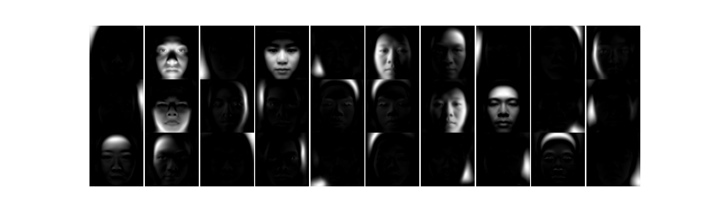
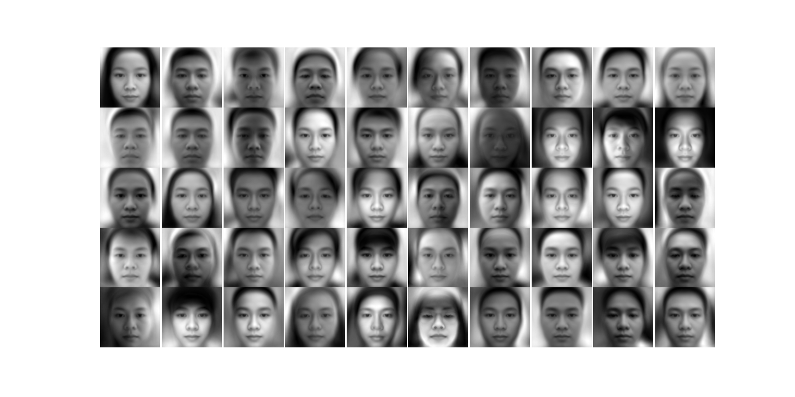
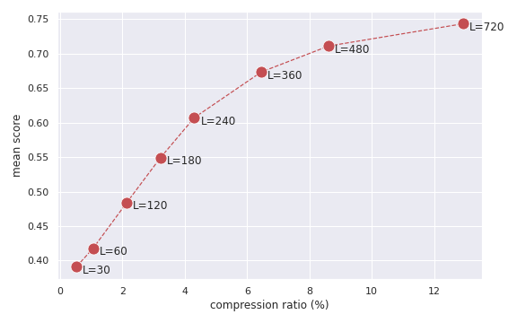

This repo contains codes needed for NMF based on MU and HALS. It implements algorithms from the paper https://arxiv.org/abs/1107.5194

This codes require numpy, cv2 and matplotlib for NMF and plots part. 

Deep learning models require tensorflow, tritonclient, protobuf. These packages are not needed for ```run.py```.

## NMF
Two NMF algorithms are implemented in ```nmf.py```, if ```alpha=0```, they reduce to non-accelerated versions.
```python
# Accelerated Multiplicative Update
accelerated_MU(X, L, alpha, epsillon, max_iter, update_func="gillis", save_every_iter=-1, save_with_index=False, save_cb=None, weight_path="", restart=False)
```
```python
# Accelerated Hierarchical ALS
accelerated_HALS(X, L, alpha, epsillon, max_iter, update_func="gillis", save_every_iter=-1, save_with_index=False, save_cb=None, weight_path="", restart=False)
```

## Results




## Main function
Main codes contained in ```run.py```. 
```bash
python run.py --help
usage: run.py [-h] [--datadir DATADIR] [--algorithm ALGORITHM] [--accelerated]
              [--update-func UPDATE_FUNC] [--L L] [--alpha ALPHA] [--eps EPS]
              [--max-iter MAX_ITER] [--outputdir OUTPUTDIR]
              [--output-recon-images] [--use-sample] [--restart]
              [--save-every SAVE_EVERY] [--save-with-index] [--seed SEED]

Accelerated MU/HALS

optional arguments:
  -h, --help            show this help message and exit
  --datadir DATADIR     path to directory containing standardized data
                        (default: None)
  --algorithm ALGORITHM
                        NMF algorithm to use, MU or HALS (default: None)
  --accelerated         whether or not to use the accelerated version
                        True/False (default: False)
  --update-func UPDATE_FUNC
                        which update function to use for hals, `paper` or
                        `gillis` (default: gillis)
  --L L                 low rank dimension (default: 30)
  --alpha ALPHA         control parameter for number of inner loop iterations,
                        ignored if accelerated=False (default: 2)
  --eps EPS             control parameter for stopping condition, ignored if
                        accelerated=False (default: 0.1)
  --max-iter MAX_ITER   number of iterations to update W and H (default: 2)
  --outputdir OUTPUTDIR
                        where to export the output (default: None)
  --output-recon-images
                        if true, will generate reconstructed images (default:
                        False)
  --use-sample          if true, make use of the list in meta.py to output
                        report (default: False)
  --restart             if true, restart from files available in outputdir
                        (default: False)
  --save-every SAVE_EVERY
                        save weight every # iterations (default: 0)
  --save-with-index     save weight every # iterations, without replacement
                        (default: False)
  --seed SEED           random seed (default: 42)
```

## Samples
Commands to run can be found in ```script_all.sh```, e.g. to perform NMF with L=30 using accelerated HALS for 100 iterations:
```bash
python run.py --datadir /mnt/i/dataset-processed --algorithm hals --accelerated --update-func gillis --L 60 --alpha 0.5 --eps 0.1 --max-iter 100 --outputdir ./HALS_Accel_L60
```

## Figures
Other Python files help generating some figures, such as compression ratio

